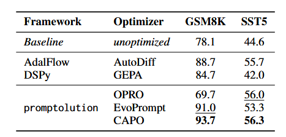

# Comparison of Prompt Optimization Frameworks

This repository provides a benchmark of the prompt optimization Libaries [DSPy](https://github.com/stanfordnlp/dspy), [AdalFlow](https://github.com/SylphAI-Inc/AdalFlow), and [Promptolution](https://github.com/automl/promptolution) on SST-5 and GSM8K.
It accompanies the paper **Promptolution: A Unified, Modular Framework for Prompt Optimization** (Link: *TBD*).

## Results




## Setup

This project uses **uv** for fast and reproducible Python dependency management.

### Prerequisites

* Python ≥ 3.12
* uv (`curl -LsSf https://astral.sh/uv/install.sh | sh`)

### Installation

```bash
git clone https://github.com/finitearth/prompt-optimization-framework-comparison.git
cd prompt-optimization-framework-comparison

uv sync
source .venv/bin/activate   # Windows: .venv\Scripts\activate
```

## Usage

In order to run the benchmarking experiments, please configure your API provider, as well as the LLM inside `configs/model_config.yaml`. Additionally add your token inside `token.txt` on the root level of this repository.

Run a benchmark for a specific task:

```bash
 uv run -m src.run_experiment --optimizer capo --task_config configs/datasets/gsm8k.yaml --token_limit 1000000
```

In order to run the evaluation of the resulting prompt, run:

```bash
uv run -m src.run_evaluation --model_config configs/model_config.yaml --task_config configs/datasets/sst5.yaml --system_prompt "<YOUR SYSTEM PROMPT>" --prompt_template "<YOUR PROMPT>"

```

Your prompt template should include a `{input}` placeholder in order to parse the data points to the LLM.

## Citation

If you use this benchmark or the associated framework, please cite:

**Promptolution: A Unified, Modular Framework for Prompt Optimization**
*(Full citation and link: TBD)*

```bibtex
@misc{promptolution2025,
  title        = {Promptolution: A Unified, Modular Framework for Prompt Optimization},
  author       = {Zehle, Tom and Hei{\ss}, Timo and Schlager, Moritz and A{\ss}enmacher, Matthias and Feurer, Matthias},
  year         = {2025},
  note         = {Link: TBD},
}
```

## Contact

For questions, issues, or collaboration ideas related to this benchmark or Promptolution, feel free to reach out:

**Tom Zehle** – [tom.zehle@tue.ellis.eu](mailto:tom.zehle@tue.ellis.eu)

